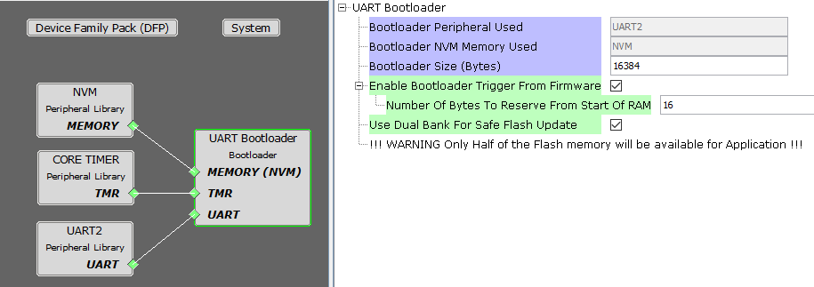
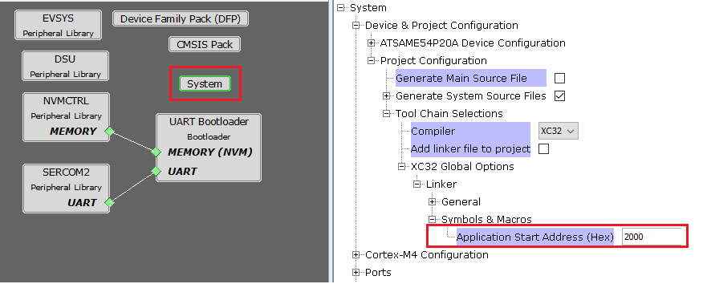
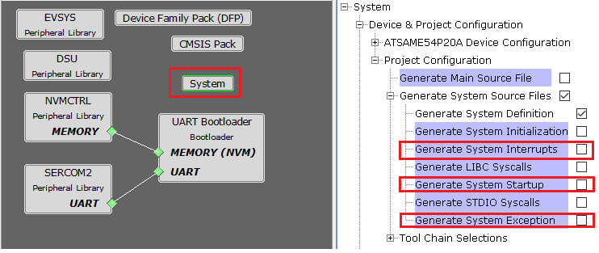

# UART Bootloader Configurations

**Bootloader Specific User Configurations**

**For CORTEX-M based MCUs**

**For MIPS based MCUs**

-   **Bootloader Peripheral Used:**

    -   Specifies the communication peripheral used by bootloader to receive the application

    -   The name of the peripheral will vary from device to device

-   **Bootloader NVM Memory Used:**

    -   Specifies the memory peripheral used by bootloader to perform flash operations

    -   The name of the peripheral will vary from device to device

-   **Bootloader Size \(Bytes\):**

    -   Specifies the maximum size of flash required by the bootloader

    -   This size is calculated based on Bootloader type and Memory used

    -   This size will vary from device to device and should always be aligned to device erase unit size

-   **Enable Bootloader Trigger From Firmware:**

    -   This Option can be used to Force Trigger bootloader from application firmware after a soft reset. It does so by reserving the specified number of bytes in SRAM from the start of the RAM. The reserved memory is updated by the application with a pre-defined pattern. The bootloader firmware in the bootloader\_Trigger\(\) routine, can check the reserved memory for the pre-defined pattern and enter bootloader mode if the pattern matches.

    -   **Number Of Bytes To Reserve From Start Of RAM:**

        -   This option adds the provided offset to RAM Start address in bootloader linker script.

        -   Application firmware can store some pattern in the reserved bytes region from RAM start for bootloader to check at reset in bootloader\_Trigger\(\) function

-   **Use Dual Bank For Safe Flash Update:**

    -   Used to configure bootloader to use Dual banks of device to upload the application

    -   This option is visible only for devices supporting Dual flash banks

**Bootloader System Configurations**

-   **Application Start Address \(Hex\):**

    -   Start address of the application which will programmed by bootloader

    -   This value is filled by bootloader when its loaded which is equal to the bootloader size. It can be modified as per user need

    -   This value will be used by bootloader to Jump to application at device reset

**Note**

-   For optimizing the code Bootloader component disables generation of default interrupt and exception files as shown below

-   Enabling these interrupts explicitly may still not work as bootloader uses custom startup file which has its own Interrupt table populating only the reset handler

-   **[Bootloader linker configurations for MIPS based MCUs](GUID-F222E4C9-8DCD-4917-A147-2EABBE9969F1.md)**  

-   **[Bootloader linker configurations for CORTEX-M based MCUs](GUID-90F92E3B-7EB3-4EF6-8A48-81D660ED6A12.md)**  

-   **[Bootloader Sizing And Considerations](GUID-7E38E7D5-AB6E-4C67-A6E6-7F3BA58FDEF3.md)**  

**Parent topic:**[UART Bootloader](GUID-7EF4113C-BB31-47A2-96E8-2965EC312340.md)

