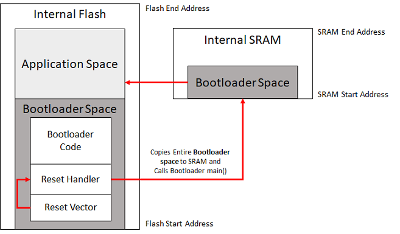
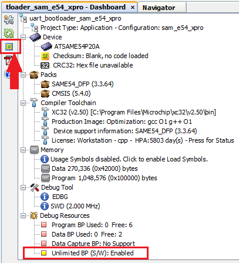
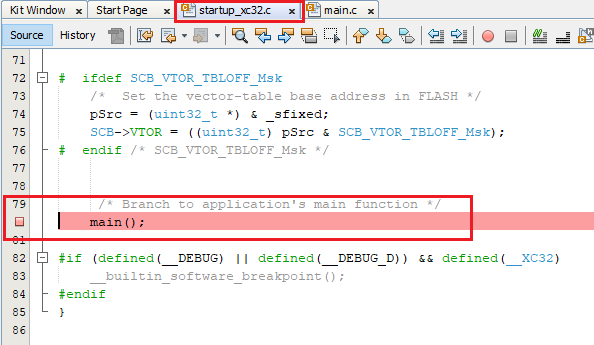
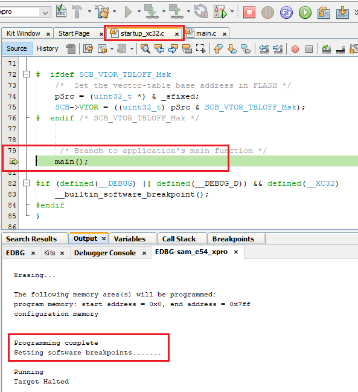
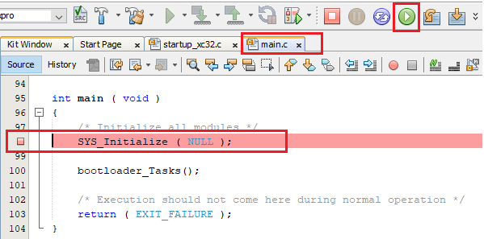
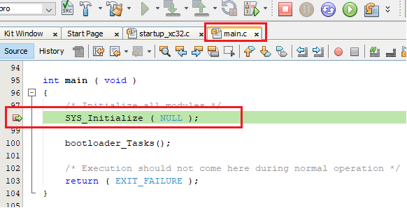

# Debugging UART, I2C and CAN Bootloaders for CORTEX-M based MCUs

The UART, I2C and CAN bootloaders for CORTEX-M based MCU's are designed to run from SRAM to support

-   Simultaneous Flash memory write and reception of the next block of data

-   Self update

-   **For debugging these bootloaders make use of software breakpoints instead of Hardware breakpoints**

**Steps to enable software breakpoints and start debugging**

-   Enable software breakpoint from the project configuration dashboard by clicking on the button as shown below

-   **Software breakpoints inside main\(\) when running from SRAM do not work when set before starting the debugger.**

    -   For them to work first set a Breakpoint in **startup\_xc32.c** file as it is running from flash

-   Start the debugger from MPLAB IDE and the **software break point** in startup file will be hit

-   Once the breakpoint is hit in startup file, then set breakpoints anywhere you want, like in **main\(\)** function as shown below

-   Resume the debugger and you should be able to now debug as usual

**Parent topic:**[Debugging Bootloader and Application to be bootloaded](GUID-05CA35ED-C84A-4F88-AAC1-F37D8F6EFEF4.md)

