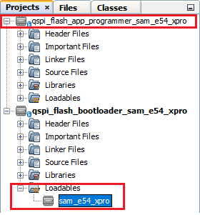

# Serial Memory Bootloader Configurations

**Bootloader Specific User Configurations**

-   **Bootloader Serial Memory Used:**

    -   Specifies the Serial memory driver used by bootloader to receive the application

    -   The name of the serial memory will vary based on the driver connected to bootloader

-   **Bootloader NVM Memory Used:**

    -   Specifies the memory peripheral used by bootloader to perform flash operations

    -   The name of the peripheral will vary from device to device

-   **Bootloader Size \(Bytes\):**

    -   Specifies the maximum size of flash required by the bootloader

    -   This size is calculated based on Bootloader type and Memory used

    -   This size will vary from device to device and should always be aligned to device erase unit size

-   **Enable Bootloader Trigger From Firmware:**

    -   This Option can be used to Force Trigger bootloader from application firmware after a soft reset. It does so by reserving the specified number of bytes in SRAM from the start of the RAM. The reserved memory is updated by the application with a pre-defined pattern. The bootloader firmware in the bootloader\_Trigger\(\) routine, can check the reserved memory for the pre-defined pattern and enter bootloader mode if the pattern matches.

    -   **Number Of Bytes To Reserve From Start Of RAM:**

        -   This option adds the provided offset to RAM Start address in bootloader linker script.

        -   Application firmware can store some pattern in the reserved bytes region from RAM start for bootloader to check at reset in bootloader\_Trigger\(\) function

**Bootloader System Configurations**

-   **Application Start Address \(Hex\):**

    -   Start address of the application which will programmed by bootloader

    -   This value is filled by bootloader when its loaded which is equal to the bootloader size. It can be modified as per user need

    -   This value will be used by bootloader to Jump to application at device reset

**Bootloader MPLAB X Settings**

-   As the Serial memory may not have any valid binary **required by bootloader** for the first time, Adding the **application to be bootloaded as loadable** allows MPLAB X to create a **unified hex file** and program both these applications in their respective memory locations

    -   By doing this, At first bootup bootloader directly jumps to application as the serial memory does not have any valid binary

\>

-   **[Bootloader linker configurations for MIPS based MCUs](GUID-F222E4C9-8DCD-4917-A147-2EABBE9969F1.md)**  

-   **[Bootloader Sizing And Considerations](GUID-7E38E7D5-AB6E-4C67-A6E6-7F3BA58FDEF3.md)**  

**Parent topic:**[Serial Memory Bootloader](GUID-AC20F067-9388-42CD-A49D-05496869CC4D.md)

