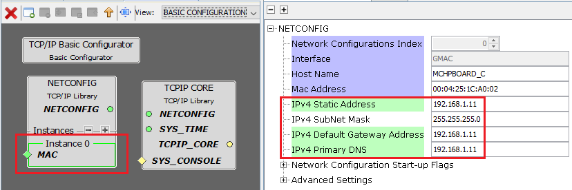
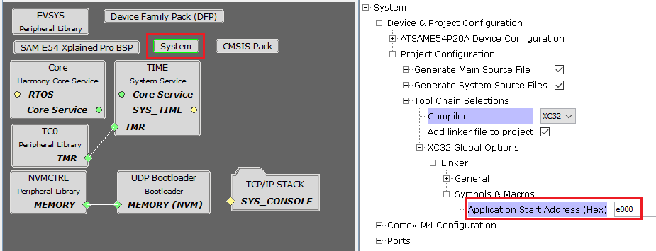
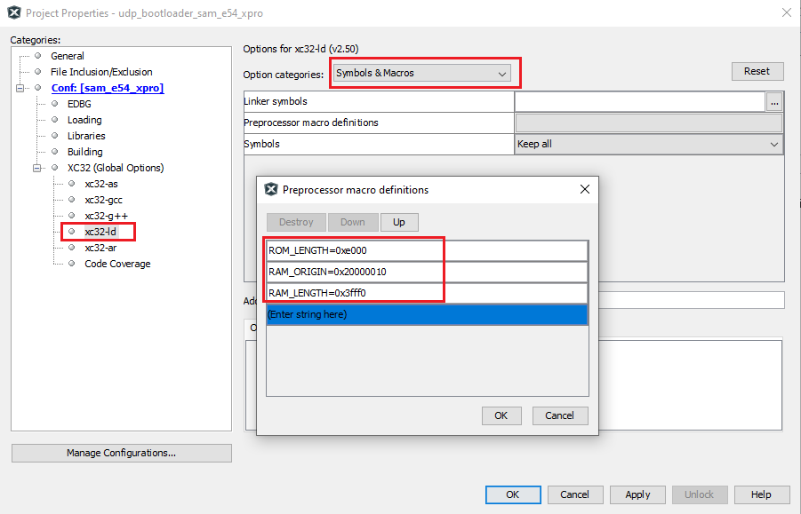

# UDP Bootloader Configurations

**Bootloader Specific User Configurations**

For Basic Bootloader

For Live Update Bootloader

-   **Bootloader NVM Memory Used:**

    -   Specifies the memory peripheral used by bootloader to perform flash operations

    -   The name of the peripheral will vary from device to device

-   **Bootloader Size \(Bytes\):**

    -   Specifies the maximum size of flash required by the bootloader

    -   This size is calculated based on Bootloader type and Memory used

    -   This size will vary from device to device and should always be aligned to device erase unit size

-   **Enable Bootloader Trigger From Firmware: \(Basic Mode Only\)**

    -   This Option can be used to Force Trigger bootloader from application firmware after a soft reset. It does so by reserving the specified number of bytes in SRAM from the start of the RAM. The reserved memory is updated by the application with a pre-defined pattern. The bootloader firmware in the bootloader\_Trigger\(\) routine, can check the reserved memory for the pre-defined pattern and enter bootloader mode if the pattern matches.

    -   **Number Of Bytes To Reserve From Start Of RAM:**

        -   This option adds the provided offset to RAM Start address in bootloader linker script.

        -   Application firmware can store some pattern in the reserved bytes region from RAM start for bootloader to check at reset in bootloader\_Trigger\(\) function

-   **Bootloader UDP Port Number:**

    -   Port number to be used to communicate via Unified Host Application

-   **Use Dual Bank For Live Update:**

    -   Used to configure bootloader library to use Inactive bank of the device to upload the new application

    -   This option is visible only for devices supporting Dual flash banks

    -   **Live Update Flash Bank Size \(Bytes\):**

        -   Specifies the size of bank in which both the bootloader and application code reside. Thisvalue by default will be half of the available Flash memory

    -   **Trigger Reset After Update:**

        -   This option can be used to trigger a **Swap bank and reset** immediatly after programming the application in inactive bank.

        -   If not enabled, then the application code should call the bootloader\_SwapAndReset\(\) function to trigger **Swap bank and reset**

**UDP Configurations**

-   **IPv4 Static Address:** 102.168.1.11

    -   To be used to configure Unified Host Application

-   **IPv4 SubNet Mask:** 255.255.255.0

-   **IPv4 Default Gateway Address:** 102.168.1.11

-   **IPv4 Primary DNS:** 102.168.1.11

**Bootloader System Configurations \(Basic Mode Only\)**

-   **Application Start Address \(Hex\):**

    -   Start address of the application which will programmed by bootloader

    -   This value is filled by bootloader when its loaded which is equal to the bootloader size. It can be modified as per user need

    -   This value will be used by bootloader to Jump to application at device reset

**Bootloader Linker Pre Processor Macros for CORTEX-M based MCUs**

-   Based on the configurations the above linker pre processor macros will be generated in MPLAB X xc32-ld settings

    -   ROM\_LENGTH specifies the size of the bootloader

Basic Mode

Live Update Mode

-   **[Bootloader linker configurations for MIPS based MCUs](GUID-F222E4C9-8DCD-4917-A147-2EABBE9969F1.md)**  

-   **[Bootloader Sizing And Considerations](GUID-7E38E7D5-AB6E-4C67-A6E6-7F3BA58FDEF3.md)**  

**Parent topic:**[UDP Bootloader](GUID-C2D4E98A-C367-48ED-9079-5AC48374542D.md)

