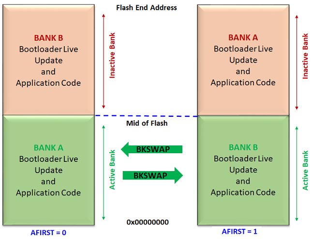

# Live Update Memory layout for CORTEX-M based MCUs

-   Supported for the devices which have a Dual Bank flash memory

-   Internal Flash memory is split into two equal banks. Special NVM Fuse setting **\(AFIRST\)** is used to identify which bank is mapped to NVM main address space after reset.

    -   Start address of **Active Bank** is always **start of Internal Flash memory**

    -   Start address of **Inactive Bank** is from mid of the Internal flash memory which can vary from device to device. Refer to respective Data sheets for details of Flash memory layout.

-   The bootloader live update code responsible to program the inactive bank is part of the application it self. Which means the programming operation can happen while the application is running

    -   **Live Update Application = \(Bootloader Code in Live Update mode + Application code\)**

    -   Having the bootloader as part of application itself avoids the overhead of memory partitioning and saves flash memory.

-   The application code is responsible to send a request to bootloader live update code to perform a **bank swap and reset** to run the new firmware programmed in Inactive bank

**Parent topic:**[How the USB Device HID Bootloader library works](GUID-BFB2EC03-1B79-42F8-A77F-26CCCEA0312C.md)

**Parent topic:**[How the UDP Bootloader library works](GUID-E5F8EA96-492F-42CA-8D42-746D091955AD.md)

