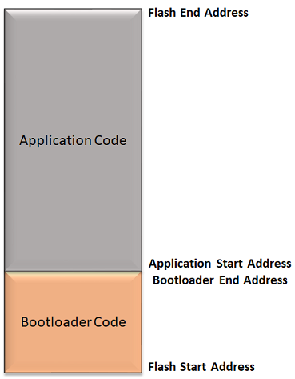

# Basic Memory layout for CORTEX-M based MCUs

The placement of the Bootloader and the application in flash memory should be such that the application will not overwrite the Bootloader, and the Bootloader can properly program the application when it is downloaded.

-   Bootloader code is always placed at start of the flash address

-   The application code can be placed anywhere after the bootloader end address. The application start address should be **aligned to Erase Unit Size of the device**

-   As the Bootloader code requires the application start address to be mentioned at compile time, it should match in both the application and bootloader

**Note:**

The start address and the end address of the Bootloader and the application will vary for different devices. Refer to respective Data sheets for details of Flash memory layout.

**Parent topic:**[How the UART Bootloader library works](GUID-03E67D01-3442-4A5E-A1D7-8C5EF776D876.md)

**Parent topic:**[How the I2C Bootloader library works](GUID-EFEE222D-BE1D-42F5-A032-C966B5DA09C2.md)

**Parent topic:**[How the CAN Bootloader library works](GUID-13849322-051C-4B2E-9CD0-632F6D89DDB0.md)

**Parent topic:**[How the Serial Memory Bootloader library works](GUID-7AD52CC2-469F-4BD3-B979-52AF12BE34FA.md)

**Parent topic:**[How the USB Device HID Bootloader library works](GUID-BFB2EC03-1B79-42F8-A77F-26CCCEA0312C.md)

**Parent topic:**[How the UDP Bootloader library works](GUID-E5F8EA96-492F-42CA-8D42-746D091955AD.md)

**Parent topic:**[How the File System Bootloader library works](GUID-90369DFF-8F80-4CB1-9536-FD4A4EA4B0DD.md)

