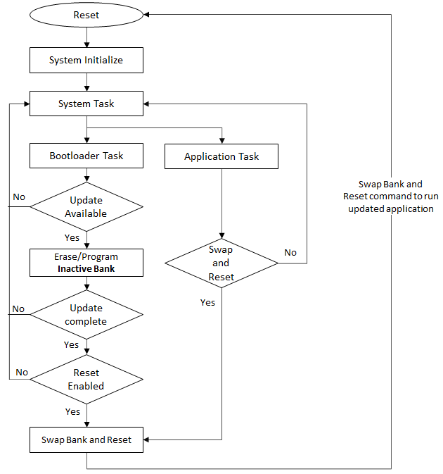
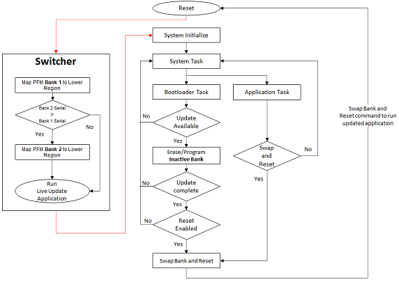

# Bootloader system level execution flow

**Basic Bootloader system level execution flow**

-   The Bootloader code starts executing on a device Reset

-   If there are no conditions to enter the firmware upgrade mode, the Bootloader starts executing the user application

    -   Refer to Bootloader Trigger Methods for different conditions to enter firmware upgrade mode

-   The Bootloader performs Flash erase/program operations while in the firmware upgrade mode

**Live Update Bootloader system level execution flow**

-   Supported for the devices which have a Dual Bank flash memory

Cortex-M Based MCUs

-   Special NVM Fuse setting **\(AFIRST\)** is used to identify which bank is mapped to NVM main address space after reset

-   The bootloader live update code responsible to program the inactive bank is part of the application it self. Which means the programming operation can happen while the application is running

    -   **Live Update Application = \(Bootloader Code in Live Update mode + Application code\)**

-   The application code is responsible to send a request to bootloader live update code to perform a **bank swap and reset** to run the new firmware programmed in Inactive bank

MIPS Based MCUs

-   Switcher Application in Boot flash memory is required to select the bank with latest firmware

    -   At reset switcher first maps Bank 1 to lower region and reads the serial numbers from both banks

    -   If Bank 2 serial number is greater than Bank 1 serial number, it maps Bank 2 to lower region by setting the Swap bit and runs the new firmware from BANK 2 else continues to run firmware from BANK 1

-   The bootloader live update code responsible to program the inactive bank is part of the application it self. Which means the programming operation can happen while the application is running

    -   **Live Update Application = \(Bootloader Code in Live Update mode + Application code\)**

-   The bootloader live update code will always program the new image in the inactive bank

-   The application code is responsible to send a request to bootloader live update code to perform a **bank swap and reset** to run the new firmware programmed in Inactive bank

-   Once this request is received the bootloader live update code performs below operation before initiating a reset to run new firmware

    -   **Inactive Serial number = Active serial number + 1**

-   **[Bootloader Trigger Methods](GUID-171634E3-4F7B-4CBD-BCE9-EC2BB22BF2AD.md)**  

-   **[USB/UDP Firmware Update mode execution flow](GUID-669D82E9-C939-4D99-A85C-1898495A568B.md)**  

**Parent topic:**[USB Device HID Bootloader](GUID-EEB0BC77-4006-44EF-8E7F-A9B4D5948189.md)

**Parent topic:**[UDP Bootloader](GUID-C2D4E98A-C367-48ED-9079-5AC48374542D.md)

