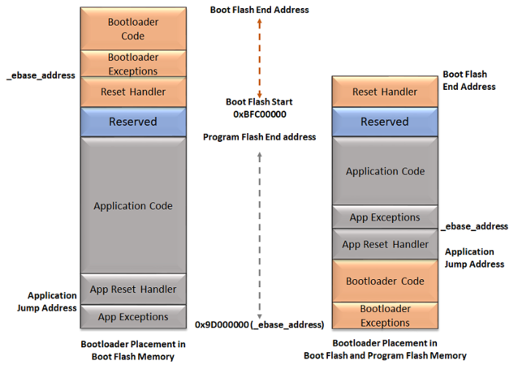

# Basic Memory layout for MIPS based MCUs

**Bootloader placement for various PIC32M product families**

The bootloader is placed in **Boot Flash Memory \(BFM\)** or **Program Flash Memory \(PFM\)** based on the size of the bootloader and available Boot flash memory on the device.

-   If the bootloader fits into the available BFM, it is placed in BFM. The user application can use the complete area of the program Flash memory.

-   If the bootloader does not fit into the available BFM, its **reset handler** is placed in BFM and rest of code is placed in PFM. The user application can use the remaining area of the program Flash memory.

-   The following table shows the available Boot Flash memory and the placement of different bootloaders by product family.

**Note:**

The Boot Flash and Program Flash memory end addresses may vary from device to device. Refer to respective Data sheets for details of Flash memory layout.

**Basic Memory layout**

**Parent topic:**[How the UART Bootloader library works](GUID-03E67D01-3442-4A5E-A1D7-8C5EF776D876.md)

**Parent topic:**[How the Serial Memory Bootloader library works](GUID-7AD52CC2-469F-4BD3-B979-52AF12BE34FA.md)

**Parent topic:**[How the USB Device HID Bootloader library works](GUID-BFB2EC03-1B79-42F8-A77F-26CCCEA0312C.md)

**Parent topic:**[How the UDP Bootloader library works](GUID-E5F8EA96-492F-42CA-8D42-746D091955AD.md)

**Parent topic:**[How the File System Bootloader library works](GUID-90369DFF-8F80-4CB1-9536-FD4A4EA4B0DD.md)

