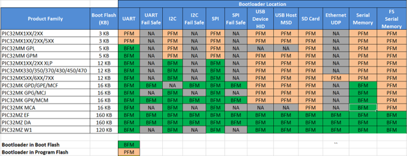

# Fail Safe Update Memory layout for MIPS based MCUs

**Bootloader placement for various PIC32M product families**

The bootloader is placed in **Boot Flash Memory \(BFM\)** or **Program Flash Memory \(PFM\)** based on the size of the bootloader and available Boot flash memory on the device.

-   If the bootloader fits into the available BFM, it is placed in BFM. The user application can use the complete area of the program Flash memory.

-   If the bootloader does not fit into the available BFM, its **reset handler** is placed in BFM and rest of code is placed in PFM. The user application can use the remaining area of the program Flash memory.

-   The following table shows the available Boot Flash memory and the placement of different bootloaders by product family.

**Note:**

The Boot Flash and Program Flash memory end addresses may vary from device to device. Refer to respective Data sheets for details of Flash memory layout.

**Fail Safe Update layout**

-   Supported for the devices which have a Dual Bank flash memory

-   **Bootloader code** is placed at start of the Boot flash memory **\(0xBFC00000\)** as upon reset the device runs from start of boot flash memory.

-   Device always executes the application firmware from PFM bank mapped to lower memory region **\(0x1D00\_0000 Physical address\)**

    -   Start address of Active Bank is mapped to lower region **0x9D000000**

    -   Start address of Inactive Bank is from mid of the PFM which can vary from device to device. Refer to respective Data sheets for details of Flash memory layout.

-   Row size number of bytes are reserved at end of each bank for storing serial number. This serial number will be used by the **bootloader code placed in BFM** to map the appropriate PFM bank to lower memory region and run the application from there

-   **Volatile register SWAP bit** is used to map either of bank to lower memory region by bootloader

-   When Bootloader is running it will program the new image in the inactive bank and performs below operation and initiates a reset

    -   **Inactive Serial number = Active serial number + 1**

-   At reset bootloader first maps Bank 1 to lower region and reads the serial numbers from both banks

-   If Bank 2 serial number is greater than Bank 1 serial number, it maps Bank 2 to lower region by setting the Swap bit and runs the new firmware. **Now Bank 2 is Active bank**

-   The application start address should always fall into lower mapped region **\(0x9D000000 to Mid of Flash\)**. Size of the application in the linker script should also not exceed the Mid of flash.

-   The address passed to bootloader during programming should fall either in active bank or inactive bank based on update being done.

**Parent topic:**[How the UART Bootloader library works](GUID-03E67D01-3442-4A5E-A1D7-8C5EF776D876.md)

