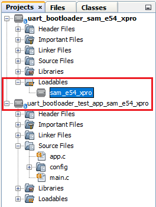
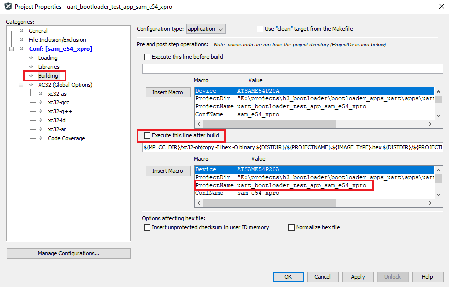

# Debugging Bootloader and Application to be bootloaded

-   Open the bootloader project to be debugged in the MPLAB IDE

-   Make sure that the **application to be bootloaded** and debugged is added as a loadable project to bootloader project

    -   Adding the **application as loadable** allows MPLAB X to create a **unified hex file** and program both bootloader and application in thier respective memory locations

        -   Bootloader in bootloader space

        -   Application in application space




-   Open the **application project** in the IDE and disable post build script exection if any as shown below

    -   Having this binary conversion post build script enabled will result in build error during debugging as there will be no hex file generated




-   Set breakpoint as required in application project. Below is a an example snapshot


-   Start debugger for the **bootloader** project using the IDE. This should program both bootloader and application


-   Once the debugger is started the bootloader first runs and then jumps to application code. You should see the application breakpoint hit if application code is running


**Additional Information \(For MIPS based MCUs\)**

-   When combining the Bootloader and Application Hex files in MPLAB X IDE, an error may be generated if the device Configuration words are different. This will be shown as a data conflict error, and the address given will match an address in the device Configuration words.

-   This can be resolved by discarding the **Device Configuration settings** from application linker file as shown below


```c
/DISCARD/ : { *(.config_*) }
```

**Parent topic:**[Debugging Bootloader and Application to be bootloaded](GUID-05CA35ED-C84A-4F88-AAC1-F37D8F6EFEF4.md)

**Parent topic:**[Serial Memory Bootloader](GUID-AC20F067-9388-42CD-A49D-05496869CC4D.md)

**Parent topic:**[USB Device HID Bootloader](GUID-EEB0BC77-4006-44EF-8E7F-A9B4D5948189.md)

**Parent topic:**[File System Bootloader](GUID-B40F9A07-D16A-42CF-8121-B52B5BDD7685.md)

